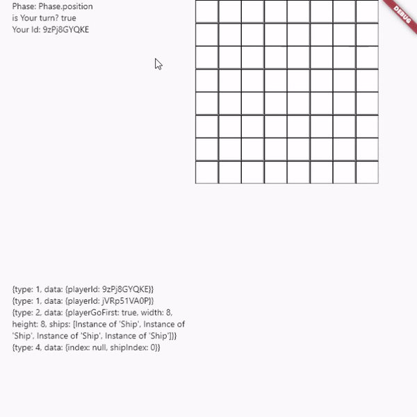

# demo_battleship

A Battleship game demo
This repo is to experiment:
- an architecture that can support mock server and actual server connection
- implementation of battle ship game

TODO:
- completing game logic
- game logic check
- testing on actual server connection
- go server for game
- ui polishment

## Game rules:

Winning Condition: Guess all enemy's ships position before enemy did it
Losing condition: Our ships are destroyed

Mechanism:
- Hide ships
- Take turn guessing each other's ships position
